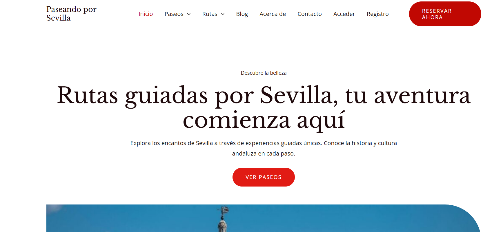
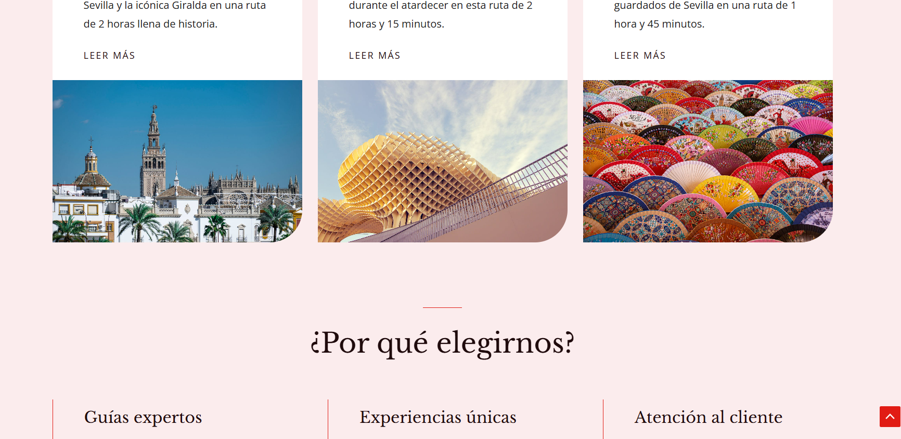
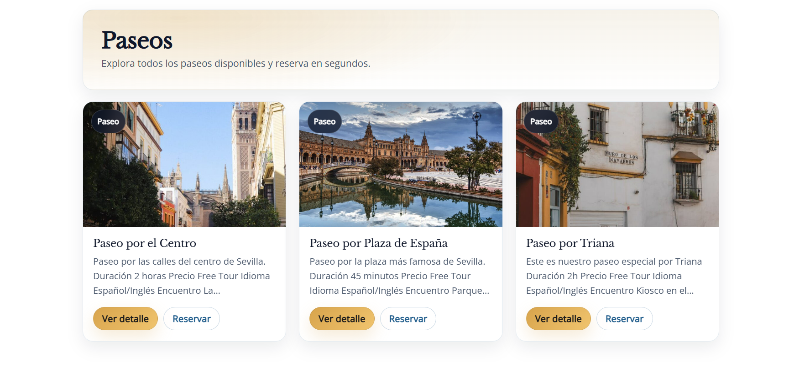
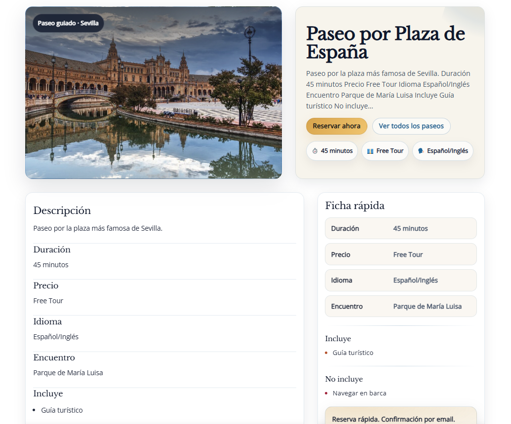
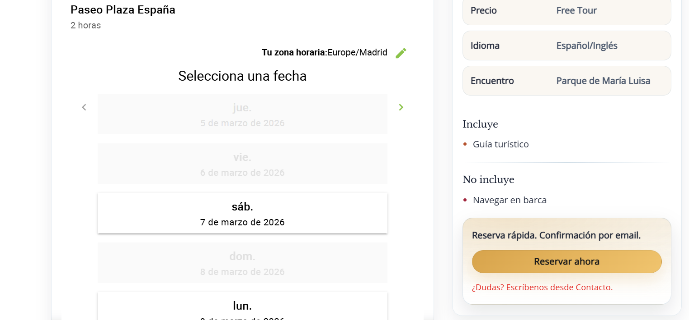

# Paseando por Sevilla — Web de reservas de paseos (WordPress)

Proyecto desarrollado con WordPress para mostrar y gestionar reservas de paseos turísticos por Sevilla.  
Forma parte de mi proceso de aprendizaje como desarrollador web y de mi portfolio profesional.

---

## ✨ ¿Qué ofrece este proyecto?

- Presentación clara de diferentes paseos turísticos.
- Página individual para cada paseo con información detallada.
- Listado automático de todos los paseos disponibles.
- Sistema de reservas integrado.
- Traducción automática a varios idiomas.
- Contacto directo mediante WhatsApp.
- Sistema de registro y login para usuarios.

---

## 🛠️ Tecnologías y herramientas utilizadas

### CMS
- **WordPress**

### Lenguajes
- **PHP**
- **HTML**
- **CSS**

### Plugins utilizados

| Plugin | Función |
|--------|---------|
| Simply Schedule Appointments | Sistema de reservas |
| GTranslate | Traducción automática |
| Click to Chat | Botón de WhatsApp |
| Ultimate Member | Registro y login de usuarios |

---

## 🧩 Conceptos técnicos aplicados

- Creación de **Custom Post Types (CPT)** para gestionar los paseos.
- Uso de la **jerarquía de plantillas** de WordPress.
- Plantillas personalizadas como `single-paseo.php`.
- Listados automáticos mediante `archive-paseo.php`.
- Encolado de estilos desde `functions.php`.
- Uso básico de **hooks**.
- Integración de plugins para ampliar funcionalidades.

---

## 📸 Capturas del proyecto

### Página principal

### Listado automático de paseos

### Página de reserva

---

## 📁 Estructura del proyecto

paseos-wordpress/
├─ README.md
├─ .gitignore
├─ public/
│  └─ docs/
│     └─ img/
│        ├─ .png
│        ├─ .png
│        └─ .png
└─ wp-content/
└─ themes/
└─ tema-hijo/
├─ style.css
├─ functions.php
├─ single-paseo.php
├─ archive-paseo.php
└─ assets/
└─ css/

---

## 🚀 Instalación en local

1. Instalar WordPress (LocalWP, XAMPP, MAMP…).
2. Copiar el tema hijo en `wp-content/themes/`.
3. Activar el tema desde el panel de WordPress.
4. Instalar los plugins:
   - Simply Schedule Appointments  
   - GTranslate  
   - Click to Chat  
   - Ultimate Member  
5. Crear varios paseos de prueba para verificar el funcionamiento.

---

## 🧠 Aprendizaje y retos

Este proyecto me permitió profundizar en:

- Cómo funciona la jerarquía de plantillas.
- Creación de un CPT desde cero.
- Encolado correcto de estilos.
- Integración de plugins sin conflictos.
- Organización del contenido mediante plantillas personalizadas.

Los principales retos fueron entender las rutas de plantillas y el funcionamiento del encolado de estilos, pero resolviéndolos aprendí a trabajar de forma más sólida con WordPress.

---

## 🔮 Mejoras futuras

- Integrar pagos online para las reservas.
- Añadir filtros por categoría o zona.
- Crear un panel de usuario con historial de reservas.
- Mejorar el diseño responsive.
- Optimizar el rendimiento general del sitio.

---

## 🏁 Conclusión

Este proyecto demuestra cómo WordPress puede convertirse en un CMS flexible mediante el uso de Custom Post Types, plantillas personalizadas y plugins.  
Ha sido un paso importante en mi aprendizaje y forma parte de mi portfolio como desarrollador web.

